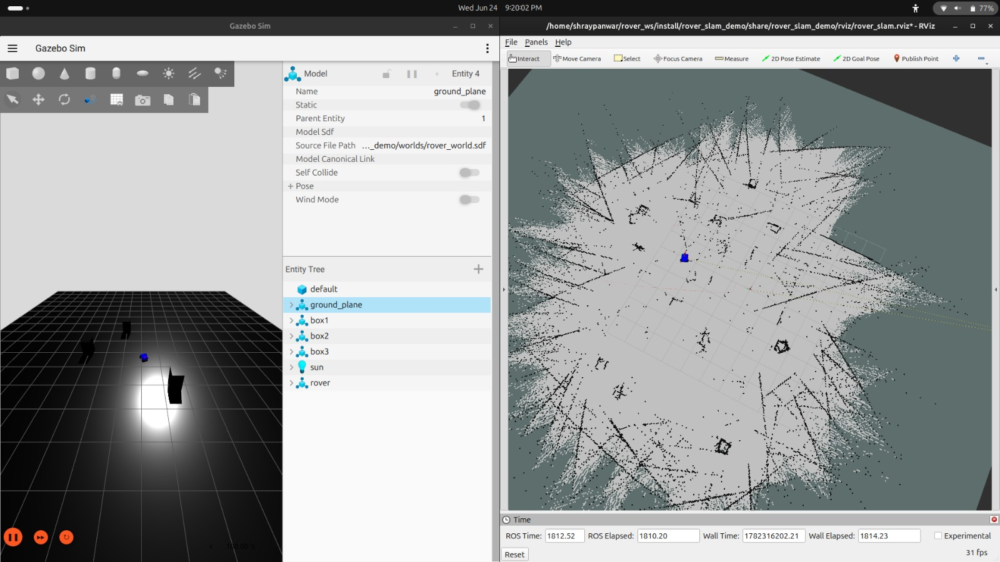
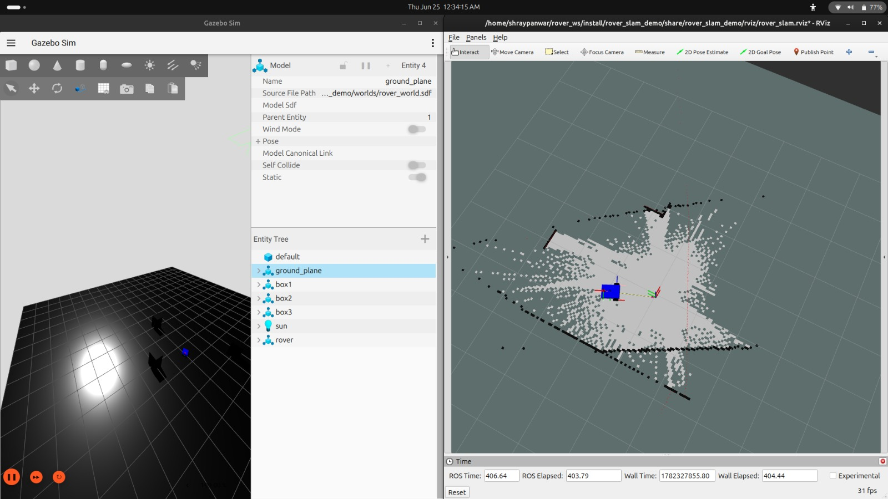
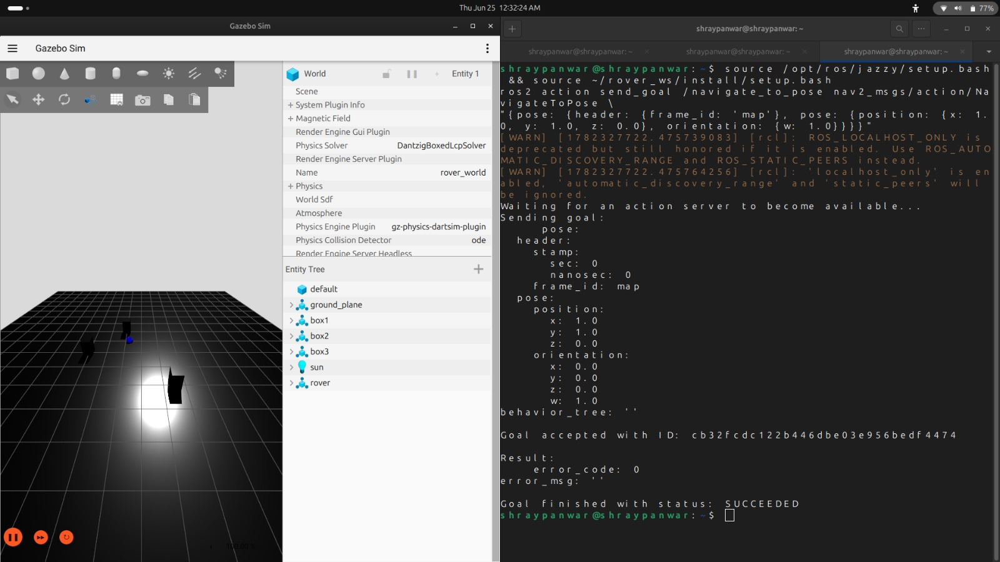
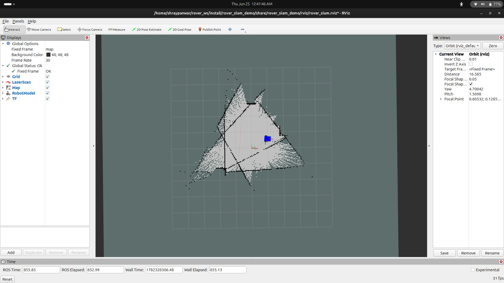

# rover_slam_demo

A custom differential drive rover built from scratch with URDF, capable of autonomous SLAM mapping and Nav2 point-to-point navigation in a Gazebo Harmonic simulation.

## Demo






---

## Tech Stack

| Component | Role |
|---|---|
| Ubuntu 24.04 + ROS2 Jazzy | Base OS and middleware |
| Gazebo Harmonic (`gz-sim`) | Physics simulation |
| Custom URDF | Differential drive rover + 360° LiDAR |
| `slam_toolbox` | Live occupancy map building |
| Nav2 | Autonomous point-to-point navigation |
| `ros_gz_bridge` | Gazebo ↔ ROS2 topic bridging |

---

## Project Structure

```
rover_slam_demo/
├── urdf/          # Custom rover robot definition
├── worlds/        # Gazebo 3D world with obstacles
├── launch/        # Startup scripts
├── config/        # Bridge, SLAM, and Nav2 parameters
├── rviz/          # RViz visualization config
├── maps/          # Saved map files
└── docs/          # Demo screenshots
```

---

## Key Technical Challenges Solved

**1. Custom Gazebo–ROS2 TF bridge**
Gazebo's DiffDrive plugin publishes transforms to `/model/rover/tf`, not the generic `/tf` topic. The bridge config must explicitly map this model-specific topic, otherwise `odom → base_link` never arrives in ROS2 and the map never forms.

**2. `slam_toolbox` base_frame mismatch**
`slam_toolbox` defaults `base_frame` to `base_footprint`. This URDF uses `base_link`. Every laser scan was silently dropped until a `slam_params.yaml` override was added. Fixed by passing `slam_params_file` via `IncludeLaunchDescription` — using a bare `Node()` with param dict breaks the TF tree entirely.

**3. Sim time synchronization**
All nodes (`robot_state_publisher`, `slam_toolbox`, Nav2, `ros_gz_bridge`) require `use_sim_time: true`. Any node running on wall clock causes TF timeouts.

---

## Setup — Run Once

### Install required packages

```bash
sudo apt install -y \
  ros-jazzy-ros-gz \
  ros-jazzy-ros-gz-bridge \
  ros-jazzy-ros-gz-sim \
  ros-jazzy-robot-state-publisher \
  ros-jazzy-slam-toolbox \
  ros-jazzy-nav2-bringup \
  ros-jazzy-nav2-map-server \
  ros-jazzy-nav2-amcl \
  ros-jazzy-teleop-twist-keyboard
```

### Clone and build

```bash
mkdir -p ~/rover_ws/src
cd ~/rover_ws/src
git clone https://github.com/shraypanwar/rover_slam_demo.git
cd ~/rover_ws
colcon build --packages-select rover_slam_demo
```

> **Note:** Run the following in every new terminal before any ROS2 command:
> ```bash
> source /opt/ros/jazzy/setup.bash
> source ~/rover_ws/install/setup.bash
> ```

---

## Part 1 — Build a Map (First Time Only)

### Terminal 1 — Launch simulation + SLAM + RViz

```bash
source /opt/ros/jazzy/setup.bash
source ~/rover_ws/install/setup.bash
ros2 launch rover_slam_demo rover_full.launch.py
```

Wait ~20 seconds for Gazebo and RViz to open fully.

### Terminal 2 — Drive the rover to build the map

```bash
source /opt/ros/jazzy/setup.bash
source ~/rover_ws/install/setup.bash
ros2 run teleop_twist_keyboard teleop_twist_keyboard
```

**Teleop controls** (click this terminal to focus it first):

| Key | Action |
|---|---|
| `i` | Forward |
| `,` | Backward |
| `j` | Turn left |
| `l` | Turn right |
| `k` | Stop |
| `q` / `z` | Increase / decrease speed |

Drive slowly around the full world for ~60 seconds. Watch the occupancy grid fill in on RViz. Make full loops — revisiting areas triggers loop closure and sharpens the map.

### Terminal 3 — Save the map

> **Important:** Terminal 1 must still be running when you save. Closing the sim before saving will fail with `Failed to spin map subscription`.

```bash
source /opt/ros/jazzy/setup.bash
source ~/rover_ws/install/setup.bash
ros2 run nav2_map_server map_saver_cli -f ~/rover_ws/my_rover_map
```

This produces `my_rover_map.pgm` (the map image) and `my_rover_map.yaml` (metadata).

---

## Part 2 — Autonomous Navigation

### Terminal 1 — Launch simulation + SLAM + RViz

```bash
source /opt/ros/jazzy/setup.bash
source ~/rover_ws/install/setup.bash
ros2 launch rover_slam_demo rover_full.launch.py
```

Wait ~20 seconds.

### Terminal 2 — Launch Nav2

```bash
source /opt/ros/jazzy/setup.bash
source ~/rover_ws/install/setup.bash
ros2 launch rover_slam_demo nav2_custom.launch.py
```

Wait until you see this line in the output:

```
[lifecycle_manager_navigation]: Managed nodes are active
```

### Terminal 3 — Send a navigation goal (Option A: terminal)

```bash
source /opt/ros/jazzy/setup.bash
source ~/rover_ws/install/setup.bash
ros2 action send_goal /navigate_to_pose nav2_msgs/action/NavigateToPose \
  "{pose: {header: {frame_id: 'map'}, pose: {position: {x: 1.0, y: 1.0, z: 0.0}, orientation: {w: 1.0}}}}"
```

Expected output: `Goal finished with status: SUCCEEDED`

### Option B: Send goal from RViz

Click **"2D Goal Pose"** in the RViz toolbar, then click anywhere on the map. The rover will plan and drive to that location autonomously.

---

## Verification Commands

Run these at any point to confirm the system is healthy:

```bash
# slam_toolbox must return: base_link
ros2 param get /slam_toolbox base_frame

# LiDAR should show ~20 Hz
ros2 topic hz /scan

# Map should show ~0.1–1 Hz (only while rover is moving)
ros2 topic hz /map

# View the full TF tree
ros2 run tf2_tools view_frames
```

---

## Full Reset (if anything breaks)

```bash
pkill -9 -f gz
pkill -9 -f slam_toolbox
pkill -9 -f rviz2
pkill -9 -f parameter_bridge
pkill -9 -f robot_state_publisher
pkill -9 -f controller_server
pkill -9 -f planner_server
pkill -9 -f bt_navigator
pkill -9 -f behavior_server
pkill -9 -f lifecycle_manager
```

Wait 5 seconds, then restart from Terminal 1.

---

## Potential Improvements

- Frontier-based autonomous exploration (replace manual teleop entirely)
- Multi-goal waypoint navigation sequences
- AMCL localization on a pre-saved map (skip re-mapping on each launch)
- Camera sensor integration for visual feedback
- 3D LiDAR for richer environment mapping
# rover_slam_demo

A custom differential drive rover built from scratch with URDF, capable of autonomous SLAM mapping and Nav2 point-to-point navigation in a Gazebo Harmonic simulation.

## Demo


---

## Tech Stack

| Component | Role |
|---|---|
| Ubuntu 24.04 + ROS2 Jazzy | Base OS and middleware |
| Gazebo Harmonic (`gz-sim`) | Physics simulation |
| Custom URDF | Differential drive rover + 360° LiDAR |
| `slam_toolbox` | Live occupancy map building |
| Nav2 | Autonomous point-to-point navigation |
| `ros_gz_bridge` | Gazebo ↔ ROS2 topic bridging |

---

## Project Structure

```
rover_slam_demo/
├── urdf/          # Custom rover robot definition
├── worlds/        # Gazebo 3D world with obstacles
├── launch/        # Startup scripts
├── config/        # Bridge, SLAM, and Nav2 parameters
├── rviz/          # RViz visualization config
├── maps/          # Saved map files
└── docs/          # Demo screenshots
```

---

## Key Technical Challenges Solved

**1. Custom Gazebo–ROS2 TF bridge**
Gazebo's DiffDrive plugin publishes transforms to `/model/rover/tf`, not the generic `/tf` topic. The bridge config must explicitly map this model-specific topic, otherwise `odom → base_link` never arrives in ROS2 and the map never forms.

**2. `slam_toolbox` base_frame mismatch**
`slam_toolbox` defaults `base_frame` to `base_footprint`. This URDF uses `base_link`. Every laser scan was silently dropped until a `slam_params.yaml` override was added. Fixed by passing `slam_params_file` via `IncludeLaunchDescription` — using a bare `Node()` with param dict breaks the TF tree entirely.

**3. Sim time synchronization**
All nodes (`robot_state_publisher`, `slam_toolbox`, Nav2, `ros_gz_bridge`) require `use_sim_time: true`. Any node running on wall clock causes TF timeouts.

---

## Setup — Run Once

### Install required packages

```bash
sudo apt install -y \
  ros-jazzy-ros-gz \
  ros-jazzy-ros-gz-bridge \
  ros-jazzy-ros-gz-sim \
  ros-jazzy-robot-state-publisher \
  ros-jazzy-slam-toolbox \
  ros-jazzy-nav2-bringup \
  ros-jazzy-nav2-map-server \
  ros-jazzy-nav2-amcl \
  ros-jazzy-teleop-twist-keyboard
```

### Clone and build

```bash
mkdir -p ~/rover_ws/src
cd ~/rover_ws/src
git clone https://github.com/shraypanwar/rover_slam_demo.git
cd ~/rover_ws
colcon build --packages-select rover_slam_demo
```

> **Note:** Run the following in every new terminal before any ROS2 command:
> ```bash
> source /opt/ros/jazzy/setup.bash
> source ~/rover_ws/install/setup.bash
> ```

---

## Part 1 — Build a Map (First Time Only)

### Terminal 1 — Launch simulation + SLAM + RViz

```bash
source /opt/ros/jazzy/setup.bash
source ~/rover_ws/install/setup.bash
ros2 launch rover_slam_demo rover_full.launch.py
```

Wait ~20 seconds for Gazebo and RViz to open fully.

### Terminal 2 — Drive the rover to build the map

```bash
source /opt/ros/jazzy/setup.bash
source ~/rover_ws/install/setup.bash
ros2 run teleop_twist_keyboard teleop_twist_keyboard
```

**Teleop controls** (click this terminal to focus it first):

| Key | Action |
|---|---|
| `i` | Forward |
| `,` | Backward |
| `j` | Turn left |
| `l` | Turn right |
| `k` | Stop |
| `q` / `z` | Increase / decrease speed |

Drive slowly around the full world for ~60 seconds. Watch the occupancy grid fill in on RViz. Make full loops — revisiting areas triggers loop closure and sharpens the map.

### Terminal 3 — Save the map

> **Important:** Terminal 1 must still be running when you save. Closing the sim before saving will fail with `Failed to spin map subscription`.

```bash
source /opt/ros/jazzy/setup.bash
source ~/rover_ws/install/setup.bash
ros2 run nav2_map_server map_saver_cli -f ~/rover_ws/my_rover_map
```

This produces `my_rover_map.pgm` (the map image) and `my_rover_map.yaml` (metadata).

---

## Part 2 — Autonomous Navigation

### Terminal 1 — Launch simulation + SLAM + RViz

```bash
source /opt/ros/jazzy/setup.bash
source ~/rover_ws/install/setup.bash
ros2 launch rover_slam_demo rover_full.launch.py
```

Wait ~20 seconds.

### Terminal 2 — Launch Nav2

```bash
source /opt/ros/jazzy/setup.bash
source ~/rover_ws/install/setup.bash
ros2 launch rover_slam_demo nav2_custom.launch.py
```

Wait until you see this line in the output:

```
[lifecycle_manager_navigation]: Managed nodes are active
```

### Terminal 3 — Send a navigation goal (Option A: terminal)

```bash
source /opt/ros/jazzy/setup.bash
source ~/rover_ws/install/setup.bash
ros2 action send_goal /navigate_to_pose nav2_msgs/action/NavigateToPose \
  "{pose: {header: {frame_id: 'map'}, pose: {position: {x: 1.0, y: 1.0, z: 0.0}, orientation: {w: 1.0}}}}"
```

Expected output: `Goal finished with status: SUCCEEDED`

### Option B: Send goal from RViz

Click **"2D Goal Pose"** in the RViz toolbar, then click anywhere on the map. The rover will plan and drive to that location autonomously.

---

## Verification Commands

Run these at any point to confirm the system is healthy:

```bash
# slam_toolbox must return: base_link
ros2 param get /slam_toolbox base_frame

# LiDAR should show ~20 Hz
ros2 topic hz /scan

# Map should show ~0.1–1 Hz (only while rover is moving)
ros2 topic hz /map

# View the full TF tree
ros2 run tf2_tools view_frames
```

---

## Full Reset (if anything breaks)

```bash
pkill -9 -f gz
pkill -9 -f slam_toolbox
pkill -9 -f rviz2
pkill -9 -f parameter_bridge
pkill -9 -f robot_state_publisher
pkill -9 -f controller_server
pkill -9 -f planner_server
pkill -9 -f bt_navigator
pkill -9 -f behavior_server
pkill -9 -f lifecycle_manager
```

Wait 5 seconds, then restart from Terminal 1.

---

## Potential Improvements

- Frontier-based autonomous exploration (replace manual teleop entirely)
- Multi-goal waypoint navigation sequences
- AMCL localization on a pre-saved map (skip re-mapping on each launch)
- Camera sensor integration for visual feedback
- 3D LiDAR for richer environment mapping
